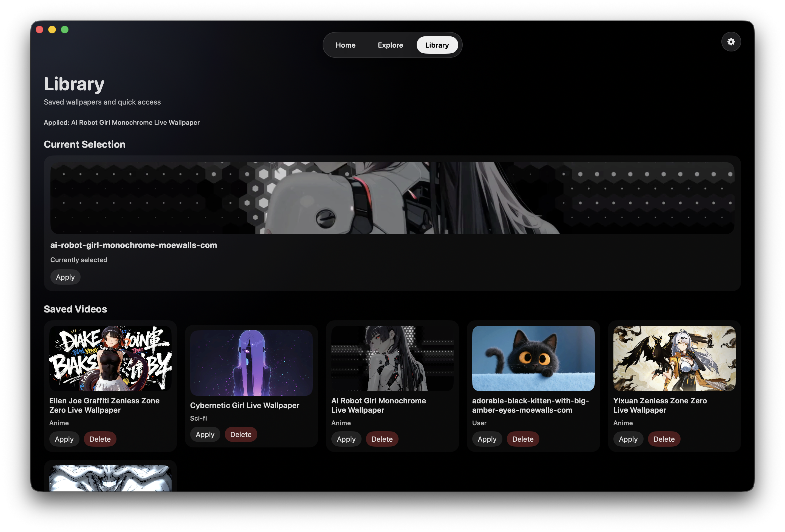
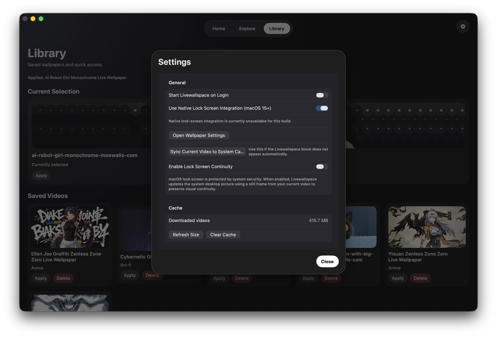
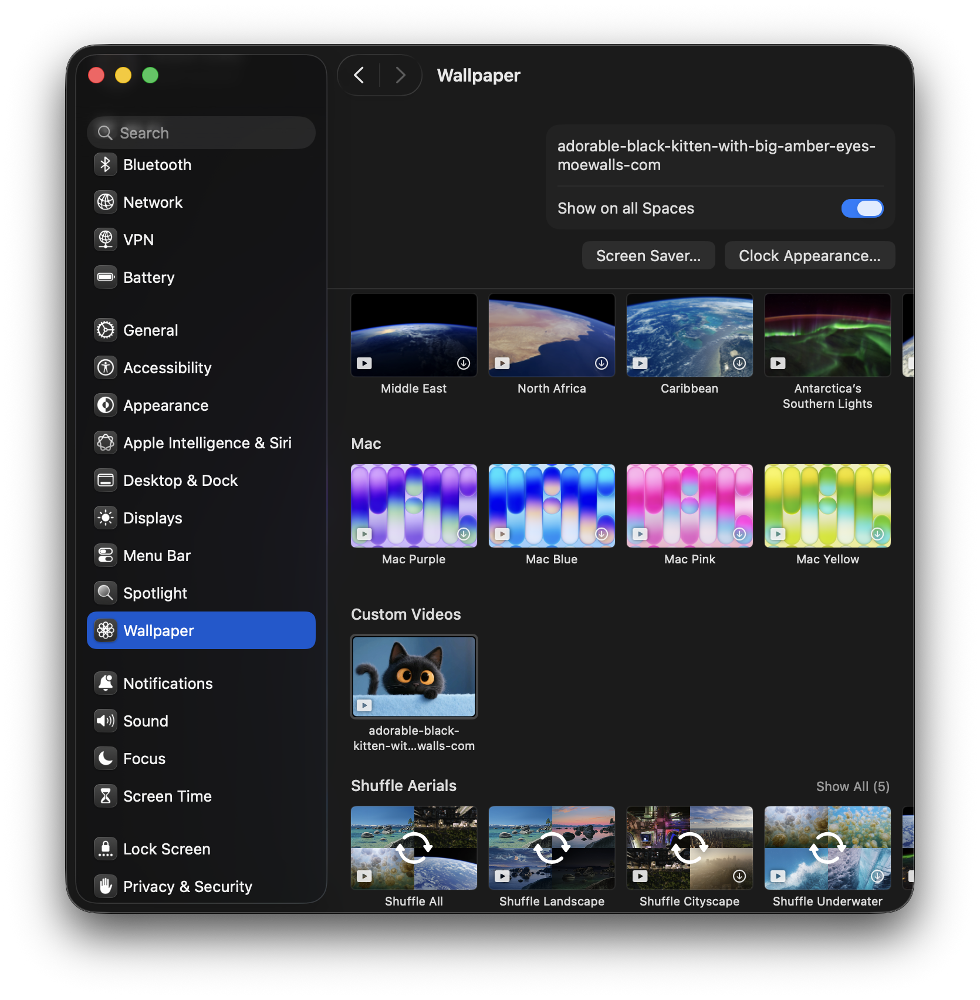

# Livewallspace

Livewallspace is a macOS app for applying animated video wallpapers to your desktop, importing videos from MoeWalls, and syncing your current wallpaper video into macOS Wallpaper settings (Custom Videos).

## Features

- Live desktop video wallpaper playback
- Multi-screen wallpaper window management
- Import and apply wallpapers from MoeWalls
- Import local MP4/MOV files
- Built-in Library for saved videos and quick re-apply
- System tray (menu bar) controls for quick actions
- Playback controls (play/pause)
- Aspect ratio modes (fill, fit, stretch)
- Frame-rate control (Auto / 24 / 30 / 60)
- Optional start at login
- Native lock-screen integration support on macOS 15+
- "Sync Current Video to System Catalog" to register current video in macOS Wallpaper settings

## App Snapshots

### Home


### Explore


### Library



### Settings



### System/Desktop/Lock Integration Examples




## Requirements

- macOS (latest recommended)
- Xcode 15+
- Apple Silicon or Intel Mac

Notes:
- Native lock-screen integration options require macOS 15+.
- Desktop wallpaper playback works independently from lock-screen integration.

## Build and Run

### Option A: Xcode (recommended)

1. Open Xcode.
2. Open this project folder.
3. Select the Livewallspace app target/scheme.
4. Press Run.

### Option B: Command line (if your project has an Xcode project/workspace in your setup)

```bash
xcodebuild -scheme Livewallspace -configuration Debug build
```

If your local setup uses a workspace, run:

```bash
xcodebuild -workspace <YourWorkspace>.xcworkspace -scheme Livewallspace -configuration Debug build
```

### Option C: Use Prebuilt ARM-Based App

If you have an Apple Silicon Mac and prefer not to build from source, you can use a prebuilt ARM-based app:

1. Download the latest prebuilt Livewallspace app from the [Releases](../../releases) page.
2. Extract the `.zip` or `.dmg` file if needed.
3. Move the `Livewallspace.app` to your **Applications** folder.
4. Launch the app from Applications or Spotlight (Cmd+Space).

**Note:** The prebuilt app is code-signed and ready to run. No build tools or Xcode installation required.

If the app does not open due to macOS quarantine, run:

```bash
xattr -d com.apple.quarantine /Applications/Livewallspace.app
```

## How to Use

### 1) Import and Apply a Video

You can import a wallpaper in two ways:

- From app content (MoeWalls):
  - Open **Home** or **Explore**.
  - Click **Import & Apply** on any wallpaper card.
- From a local file:
  - Open **Explore**.
  - Click **Use Local MP4/MOV** and pick your video.

After import, the selected video is applied as desktop wallpaper.

### 2) Open App Settings

- Click the gear icon in the app UI (top-right), or
- Open app Settings from the app menu.

### 3) Open Wallpaper Settings and Select Custom Videos

In Settings:

1. Click **Open Wallpaper Settings**.
2. In macOS Wallpaper settings, look for Livewallspace content under **Custom Videos**.
3. Select the synced video.

If you cannot see the video:

1. Close the macOS Wallpaper/System Settings window.
2. Return to Livewallspace Settings.
3. Click **Sync Current Video to System Catalog**.
4. Open Wallpaper settings again.
5. Check **Custom Videos** and select your synced video.

## Recommended Flow for Setting Video Wallpaper

1. Import and apply a video (from app content or local MP4/MOV).
2. Open app Settings.
3. Open Wallpaper settings and pick the synced item from Custom Videos.
4. If missing, close system Wallpaper settings, run **Sync Current Video to System Catalog**, then reopen Wallpaper settings.

## Tips

- If sync says no video is selected, first import/apply a video, then sync.
- Use the Library tab for quick re-apply of saved wallpapers.
- Use frame-rate and aspect-ratio settings to balance quality/performance.

## Disclaimer

Wallpapers imported from third-party sources remain subject to their original licenses/rights. Please respect the source platform terms and creator rights.
